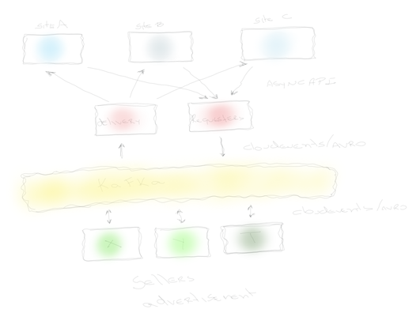

# Overview

This is a repository represents the Delivery at the Advertisement Architecture.

# Architecture

## Schema

All the schemas are found in `/apache-avro-producer/src/main/avro`

## Set up

Start the kafka and kafka schema registry, using the command below:

`docker-compose up`

# References

[Guide to Spring Cloud Stream with Kafka, Apache Avro and Confluent Schema Registry](https://www.baeldung.com/spring-cloud-stream-kafka-avro-confluent)